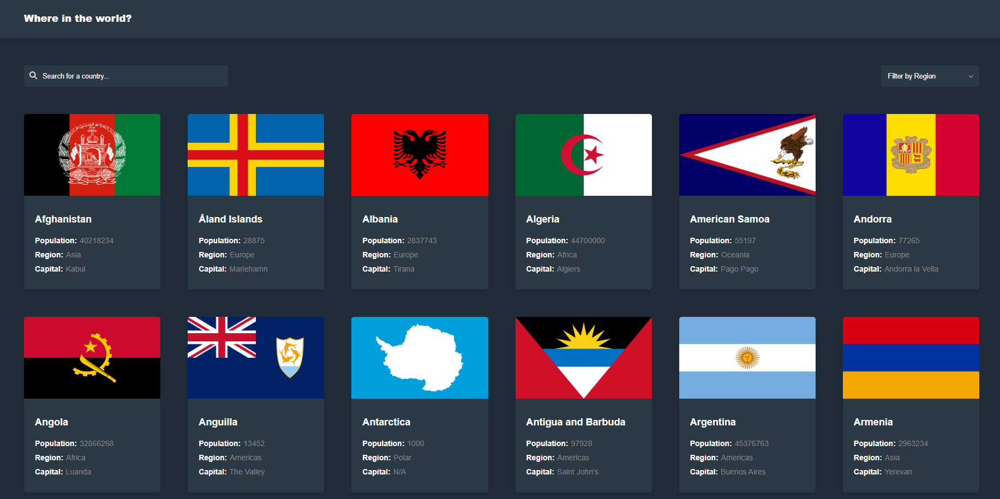

## Key Features

- **Gatsby**: A React-based framework optimized for performance and SEO, perfect for static and dynamic sites.
- **TypeScript**: Adds type safety to JavaScript, helping catch errors early and write cleaner, maintainable code.
- **GraphQL**: Leverages Gatsby's GraphQL layer to easily query data from Markdown files, APIs, or CMS.

## Getting Started

1. **Clone the repo** and install dependencies:
   ```bash
   git clone <repository-url>
   cd project-directory
   npm install
   ```
2. **Start the development server:**
   ```bash
   gatsby develop
   ```
3. **Build for production:**
   ```bash
   gatsby build
   ```

📁 Project Structure
Here's a quick overview of the project structure:

   ```bash
├── src
│   ├── components // Reusable UI components
│   ├── pages      // Route-based pages
│   ├── templates  // Dynamic templates for GraphQL-driven pages
│   ├── styles     // CSS stylesheets
│   ├── utils     // Search and Select filters
├── gatsby-config.js // Gatsby configuration file
└── gatsby-node.js   // Node APIs, used to create dynamic pages
```

## Preview


Check out the live version [here](https://termjs.github.io/gatsby-countries/).
